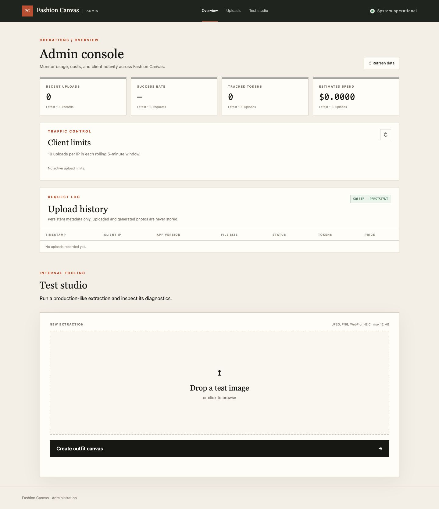
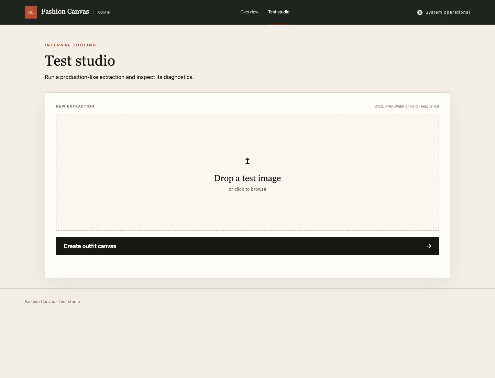

# Fashion Canvas Server

> [!IMPORTANT]
> **This entire repository, including the application, design, tests, documentation, and deployment setup was made with AI.**

Turn a mirror selfie into a stylized, person-free outfit canvas plus an array of individually rendered pieces with descriptive labels. The same service includes an admin console at `/`, a separate test studio at `/studio.html`, and a JSON API intended for a future mobile client.

## Screenshots





## API

`POST /api/outfits` accepts `multipart/form-data` with one `photo` field (JPEG, PNG, WebP, HEIC, or HEIF; maximum 12 MB).

```json
{
  "styledOutfit": "data:image/jpeg;base64,...",
  "pieces": [
    {
      "id": "outerwear-1",
      "label": "Cropped denim jacket",
      "description": "Washed indigo denim with a boxy fit and silver buttons",
      "category": "outerwear",
      "image": "data:image/jpeg;base64,..."
    }
  ]
}
```

Each client IP may start 10 upload requests in a rolling five-minute window. The rate-limit events are stored in SQLite, so limits survive application restarts. `GET /api/debug/rate-limits` returns the current counters used by the dashboard.

The admin upload history records the request timestamp, client IP, `X-App-Version` header (or `web`), uploaded file size, completion status, token usage, and estimated/calculated USD price. It deliberately stores neither source photos nor generated images. `GET /api/admin/uploads?limit=100` returns the newest metadata records (up to 500).

The Coolify deployment sets `TRUST_PROXY=2` for its two-proxy topology, so Express resolves the public client address from the right side of `X-Forwarded-For` without accepting a spoofed address prepended by the client. Without an override, the server trusts loopback, link-local, and private-network proxies. Set `TRUST_PROXY` to a comma-separated Express trust list or the exact hop count when the topology differs.

Each successful debug result also shows the OpenAI models, image dimensions and byte sizes, token usage when returned, stage timings, output settings, request ID, and estimated USD cost. Cost is an estimate based on standard API pricing rather than an invoice total; when image-edit token usage is unavailable, the estimate excludes those input tokens and says so in the UI.

## Local development

```sh
cp .env.example .env
npm ci
npm run dev
```

Open `http://localhost:3000`. The OpenAI key stays server-side. Run `npm test`, `npm run test:e2e`, and `npm run build` before shipping.

## Deployment

The Docker image listens on port 3000 and exposes `/health`. Configure `OPENAI_API_KEY` as a secret environment variable. Optional model settings are documented in `.env.example`.

SQLite defaults to `/data/fashion-canvas.sqlite` in the container. Mount a persistent volume at `/data`; the included Compose definition uses the named `fashion-canvas-data` volume. Back up that volume to retain upload history and rate-limit state across server replacement.

The admin console, test studio, and operational APIs use HTTP Basic Auth in production. Mount the username and password as files at `/run/secrets/admin_username` and `/run/secrets/admin_password`; credentials are read from `ADMIN_USERNAME_FILE` and `ADMIN_PASSWORD_FILE`. The service fails to start in production when either secret is missing or empty. The mobile-facing `POST /api/outfits` and `/health` endpoints remain available without admin credentials.

The Gitea workflow keeps build, unit test, browser test, and image publishing in separate jobs. It authenticates to Gitea's container registry with the built-in per-run token, so no custom registry secrets are required. Coolify deployments are triggered manually after a successful pipeline and pull the published image rather than building source.

## Privacy

Uploaded photos are held in memory only for processing and are not persisted by this service. They are sent to OpenAI to analyze and generate the requested images. Review the applicable OpenAI data controls before production use and add authentication before exposing operational diagnostics publicly.

The browser offers an adjustable edge crop and submits a new cropped JPEG with a maximum 1280px long edge, so discarded room and mirror pixels are never sent to OpenAI. The server repeats the same no-upscaling normalization as a safeguard. Override `INPUT_MAX_DIMENSION` to trade input-image cost and latency against fine garment detail. Generated outputs use GPT Image's low-quality mode: 1024×1024 for the complete outfit and 816×816 for each individual piece.

## License

Fashion Canvas Server is available under the [PolyForm Noncommercial License 1.0.0](LICENSE). It is free to use, modify, and share for noncommercial purposes. Commercial use or monetization is reserved to the licensor and requires a separate commercial license.

This is a source-available license, not an OSI-approved open-source license.
